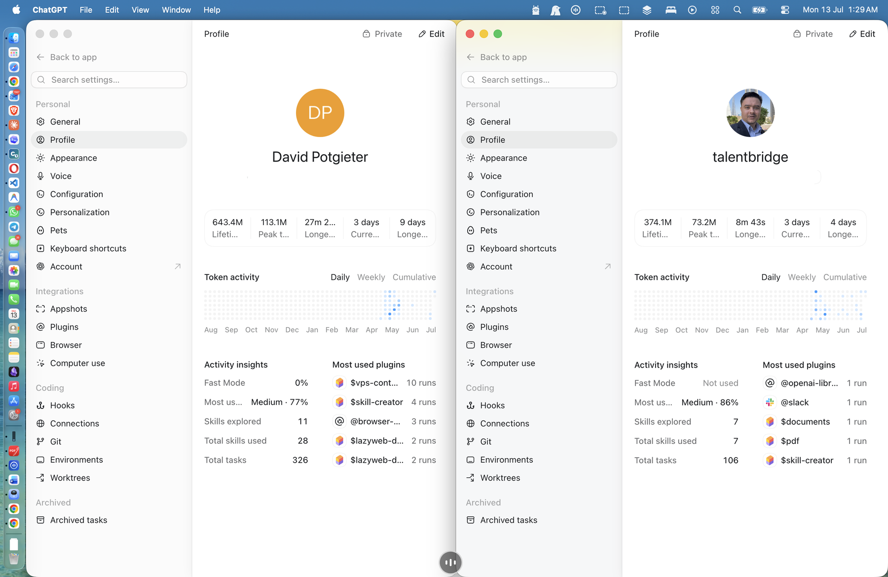

# Codex Multi-Profile Launcher for macOS

Run C1 as an isolated Business profile while C2 remains the normal/default Codex profile on the same Mac.

Unofficial community project: it may be changed or taken down at OpenAI's request, so feel free to fork it now if it is useful to you.

This project creates one Dock-friendly isolated launcher for C1. C2 is the normal/default ChatGPT/Codex profile.

- `CODEX_HOME`
- ChatGPT/Codex desktop app data directory
- login session
- Dock icon
- profile label for `C1`; the standard app is `C2`

It is useful if you want:

- Codex multiple profiles
- Codex desktop separate accounts
- ChatGPT Codex desktop profiles
- multiple Codex accounts on macOS
- a Codex profile switcher without logging out
- isolated `CODEX_HOME` launchers
- separate Codex Business and personal profiles
- parallel Codex desktop sessions

## Start Here: Agent Install Prompt

If you want a coding agent to install this for you, copy this prompt into Claude Code, Codex, Cursor, Windsurf, or your preferred local coding agent:

```text
You are helping me install the Codex Multi-Profile Launcher for macOS.

Goal:
Create one isolated C1 Business launcher while preserving the normal/default ChatGPT/Codex app as C2.

Repository:
https://github.com/tbhrc/codex-multi-profile-launcher

Please do the following:
1. Verify I am on macOS.
2. Verify the ChatGPT/Codex desktop app exists, usually at /Applications/ChatGPT.app.
3. Verify the Codex CLI is available by running codex --version.
4. Clone the repository if it is not already present.
5. Run bash scripts/bootstrap.sh from the repository root.
6. Run bash scripts/install-macos-launchers.sh from the repository root.
7. Confirm that `~/Applications/Codex C1 Business.app` was created. The installed `/Applications/ChatGPT.app` remains C2.
8. Open C1 with:
   open -n "$HOME/Applications/Codex C1 Business.app"
9. Verify the C1 process uses:
   --user-data-dir=$HOME/Library/Application Support/Codex-C1-Business
10. Tell me to sign into the Business account for C1. Do not create or migrate a separate C2 home; C2 is the default app/profile.

Important safety rules:
- Do not read, print, copy, or move any auth.json file.
- Do not copy credentials between profiles.
- Treat the default `~/.codex` profile as C2 and do not replace or clone it.
- Do not delete existing app data.
- If /Applications/ChatGPT.app is missing, stop and tell me exactly what path you checked.

Expected result:
I should have exactly two intended Codex profiles:
- C1 Business: `~/.codex-business` + `~/Library/Application Support/Codex-C1-Business`
- C2 default: `~/.codex` + `~/Library/Application Support/Codex`
```

After the agent finishes, add `Codex C1 Business.app` to your Dock if useful. C2 remains the normal installed ChatGPT app.

## What Problem This Solves

The normal ChatGPT/Codex desktop app uses one default desktop profile. If you switch accounts inside that app, you interrupt the current login and workspace.

This repository creates one additional launcher app:

```text
Codex C1 Business.app
```

Each launcher starts the installed ChatGPT/Codex desktop app with a different runtime boundary.

| Launcher | Codex CLI home | Desktop app data |
|---|---|---|
| Codex C1 Business | `~/.codex-business` | `~/Library/Application Support/Codex-C1-Business` |
| C2 / Regular ChatGPT-Codex app | `~/.codex` | `~/Library/Application Support/Codex` |

The result is two intended profiles: isolated C1 plus the original/default app as C2.

## Example: Side-by-Side Profiles

This historical screenshot shows the earlier two-launcher experiment. Current operation uses one isolated C1 launcher and the normal/default app as C2.



## Build Telemetry

This repository was created through a real Codex-assisted implementation session. The captured usage report is available in [docs/TELEMETRY_REPORT.md](docs/TELEMETRY_REPORT.md).

## Requirements

- macOS
- The ChatGPT/Codex desktop app installed at `/Applications/ChatGPT.app`
- Codex CLI available on your `PATH`
- Bash, Python 3, `sips`, `iconutil`, and `qlmanage` (standard on macOS)

Check:

```bash
codex --version
ls -ld /Applications/ChatGPT.app
```

## Quick Start

Clone the repo:

```bash
git clone https://github.com/tbhrc/codex-multi-profile-launcher.git
cd codex-multi-profile-launcher
```

Bootstrap the C1 isolated home (C2 already uses the default home):

```bash
bash scripts/bootstrap.sh
```

Create the C1 Dock launcher:

```bash
bash scripts/install-macos-launchers.sh
```

Open `~/Applications`, then add the C1 launcher to your Dock if useful:

```text
Codex C1 Business.app
```

Use the C1 launcher for Business. Use the normal ChatGPT/Codex app for C2.

## Custom Names

The default labels are:

- `C1` = Codex Business
- `C2` = normal/default Codex profile

You can customize the launcher names during installation:

```bash
C1_APP_NAME="Codex C1 Work" \
bash scripts/install-macos-launchers.sh
```

You can also install to a different applications folder:

```bash
APPS_DIR="$HOME/Desktop" bash scripts/install-macos-launchers.sh
```

If your ChatGPT/Codex app is not in `/Applications/ChatGPT.app`:

```bash
CHATGPT_APP="/path/to/ChatGPT.app" bash scripts/install-macos-launchers.sh
```

## How It Works

The C1 launcher does not copy credentials; it starts the installed app with a separate C1 environment and user-data path. C2 continues to use the default app state.

For C1:

```bash
export CODEX_HOME="$HOME/.codex-business"
exec /Applications/ChatGPT.app/Contents/MacOS/ChatGPT \
  --user-data-dir="$HOME/Library/Application Support/Codex-C1-Business"
```

For C2, launch the normal installed ChatGPT/Codex app. Its Codex home is `~/.codex` and its app data is `~/Library/Application Support/Codex`. No second C2 launcher or home is created.

## Scripts

| Script | Purpose |
|---|---|
| `scripts/bootstrap.sh` | Creates/validates the isolated C1 home; leaves C2 default `~/.codex` intact |
| `scripts/install-macos-launchers.sh` | Creates the C1 `.app` launcher and icon |
| `scripts/launch-codex-business-desktop.sh` | Launches C1 desktop profile |
| `scripts/auth-codex-business.sh` | Runs CLI login for C1 |
| `scripts/auth-codex-c2.sh` | Runs CLI login for C2 |
| `scripts/status.sh` | Shows login status for C1 and default C2 |

## Testing

Validate the bridge:

```bash
python3 tools/aosctl.py validate --verbose
python3 -m unittest tests/test_aosctl.py
```

Open C1 and verify the process:

```bash
open -n "$HOME/Applications/Codex C1 Business.app"
ps -axo pid,args | grep 'Codex-C1-Business'
```

You should see the app running with:

```text
--user-data-dir=/Users/<you>/Library/Application Support/Codex-C1-Business
```

## Security Notes

This project intentionally ignores credentials and local app state.

Do not commit:

- `auth.json`
- `.env`
- API keys
- copied app data
- `~/Library/Application Support/Codex*`

The repository includes `.gitignore` rules for common credential files, but you should still review before publishing your fork.

## Known Limitation

This is a macOS-first launcher pattern. It was tested with the ChatGPT/Codex desktop app on macOS.

If the app changes how it handles login or `--user-data-dir`, the launch scripts may need adjustment.

## Disclaimer: Unofficial Community Project

This is an independent, unofficial community project. It is not created, maintained, endorsed, sponsored, approved, or supported by OpenAI. It is not affiliated with OpenAI, ChatGPT, Codex, or the ChatGPT desktop app team in any way.

All product names, trademarks, service marks, logos, and brand references, including OpenAI, ChatGPT, Codex, and macOS, belong to their respective owners. They are mentioned only to describe compatibility and the user problem this project attempts to solve.

This repository does not provide, modify, bypass, or redistribute OpenAI accounts, subscriptions, credentials, authentication files, application binaries, or proprietary OpenAI software. It only creates local macOS launcher wrappers around an app that you must already have installed and be authorized to use.

You are responsible for using this project in compliance with OpenAI's terms, your workspace policies, your employer's rules, and any applicable laws. Do not use this project for account sharing, quota evasion, credential movement, policy bypassing, or any other use that violates the rules of the services you access.

If OpenAI, ChatGPT, Codex, or an authorized representative of OpenAI requests that this project be changed, renamed, restricted, unpublished, or removed, the maintainer may do so at any time, without prior notice. This repository may therefore be modified or taken down at the request of OpenAI.

## License

MIT.
